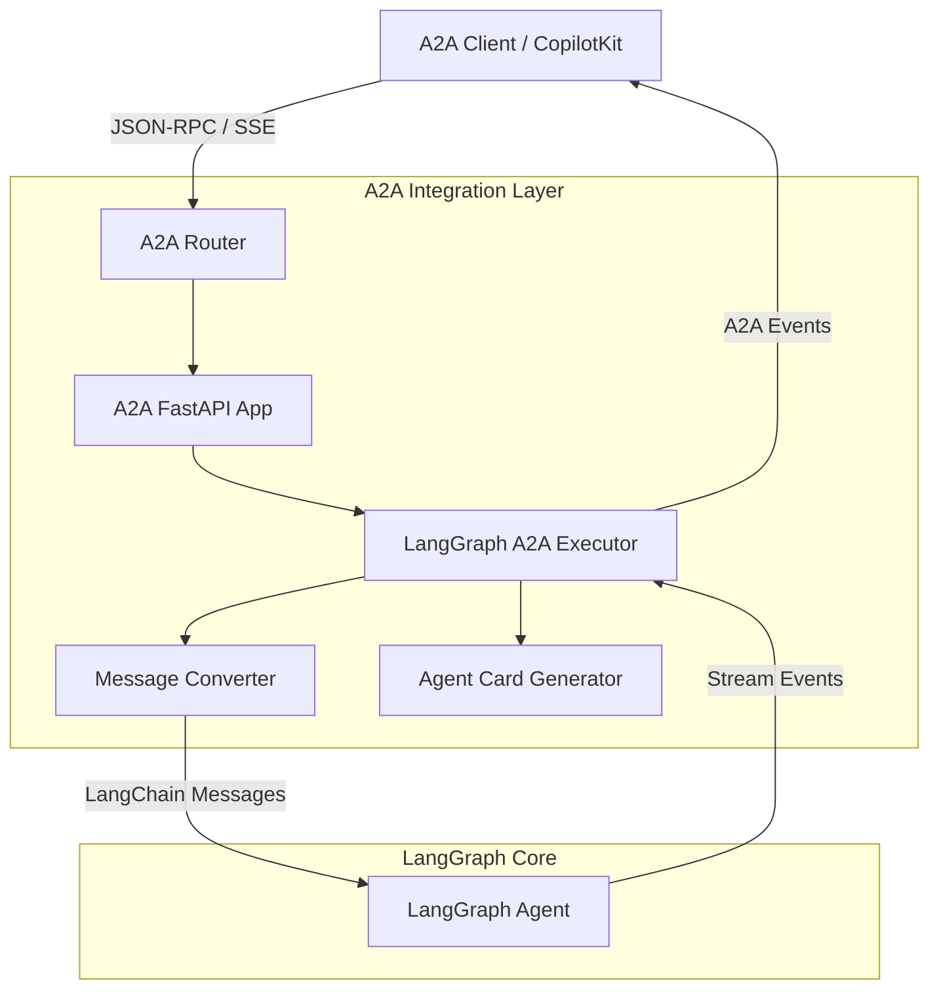

# A2A (Agent-to-Agent) 프로토콜 통합 레이어

이 디렉토리는 LangGraph 에이전트가 외부의 A2A 호환 클라이언트 또는 다른 에이전트와 통신할 수 있도록 지원하는 **A2A(Agent-to-Agent) 프로토콜** 통합 레이어를 포함하고 있습니다.

---

## 1. 폴더 개요

`src/agent_server/a2a/` 모듈은 OpenSource LangGraph Platform의 에이전트를 표준화된 A2A 프로토콜 엔드포인트로 노출하는 역할을 합니다. 이를 통해 다음과 같은 이점을 얻을 수 있습니다.

- **상호 운용성**: A2A 표준을 준수하는 다양한 클라이언트(예: CopilotKit, 다른 AI 에이전트)와 즉시 연동 가능
- **표준화된 통신**: JSON-RPC 기반의 표준 메시지 규격을 사용하여 에이전트 간 협업 지원
- **자동 발견**: Agent Card(.well-known)를 통한 에이전트 능력 및 메타데이터 자동 제공

## 2. A2A 프로토콜 개요

A2A 프로토콜은 에이전트 간 또는 에이전트와 사용자 인터페이스 간의 통신을 위한 오픈 표준입니다.

- **표준 사양**: JSON-RPC 2.0을 기반으로 메시지 전달, 작업(Task) 상태 추적, 스트리밍 이벤트를 지원합니다.
- **필요성**: 각기 다른 프레임워크로 구현된 에이전트들이 공통된 언어로 대화하고, 복잡한 멀티 에이전트 워크플로우를 구성하기 위해 필요합니다.
- **주요 기능**:
  - `agent-card`: 에이전트의 이름, 설명, 기술(Skills) 정의
  - `message-send`: 에이전트에게 메시지 전송 및 작업 시작
  - `task-stream`: 작업 진행 상황 및 응답의 실시간 스트리밍(SSE)

## 3. 파일 목록 및 설명

| 파일 | 역할 상세 |
|------|-----------|
| `router.py` | FastAPI `APIRouter`를 정의하며, `/a2a/{graph_id}` 경로로 들어오는 모든 A2A 요청을 처리합니다. 에이전트 목록 조회 및 Agent Card 제공 엔드포인트를 포함합니다. |
| `executor.py` | `LangGraphA2AExecutor` 클래스를 포함합니다. A2A SDK의 `AgentExecutor`를 구현하여 LangGraph 그래프의 `astream()` 메서드를 호출하고 실행 상태를 A2A 이벤트로 변환합니다. |
| `converter.py` | `A2AMessageConverter` 클래스를 포함합니다. A2A의 `Message`/`Part` 형식과 LangChain의 `BaseMessage`(Human/AI) 형식 간의 양방향 변환을 담당합니다. |
| `card_generator.py` | `AgentCardGenerator` 클래스를 포함합니다. 그래프의 메타데이터, 독스트링, 도구(Tools) 정보를 분석하여 A2A 규격에 맞는 `AgentCard` 객체를 생성합니다. |
| `detector.py` | 에이전트(그래프)가 A2A 프로토콜과 호환되는지 검사합니다. 기본적으로 상태 스키마에 `messages` 필드가 있는지 확인합니다. |
| `decorators.py` | `@a2a_metadata` 데코레이터를 제공합니다. 에이전트의 이름, 설명, 기술 등을 코드 레벨에서 선언적으로 정의할 수 있게 합니다. |
| `types.py` | A2A 통합에서 사용하는 내부 타입 및 설정 구조체를 정의합니다. |
| `__init__.py` | 모듈의 외부 노출 인터페이스를 정의합니다. |

## 4. 아키텍처 다이어그램



## 5. 데이터 흐름

1. **에이전트 발견**: 클라이언트가 `/a2a/{graph_id}/.well-known/agent-card.json`을 요청하면 `CardGenerator`가 에이전트 정보를 반환합니다.
2. **요청 수신**: 클라이언트가 `/a2a/{graph_id}`로 `message-send` JSON-RPC 요청을 보냅니다.
3. **메시지 변환**: `Converter`가 A2A 메시지를 LangChain `HumanMessage`로 변환합니다.
4. **그래프 실행**: `Executor`가 LangGraph의 `astream()`을 호출하여 실행을 시작합니다.
5. **실시간 스트리밍**: 그래프에서 발생하는 청크(Chunk)를 `Executor`가 캡처하여 A2A `working` 상태 및 `agent-message` 이벤트로 클라이언트에 스트리밍합니다.
6. **작업 완료**: 실행이 끝나면 `Executor`가 최종 결과물을 `artifact`로 전송하고 작업을 완료(`complete`)합니다.

## 6. 사용 예제

### 에이전트에 A2A 메타데이터 설정하기

그래프 정의 파일에서 데코레이터를 사용하여 에이전트의 정보를 설정할 수 있습니다.

```python
from src.agent_server.a2a import a2a_metadata

@a2a_metadata(
    name="날씨 비서",
    description="전 세계의 날씨 정보를 알려주는 에이전트입니다.",
    skills=[
        {"id": "weather_lookup", "name": "날씨 조회", "description": "특정 지역의 날씨를 확인합니다."}
    ]
)
def create_weather_graph():
    # ... LangGraph 정의 ...
    return workflow.compile()
```

### A2A 엔드포인트 호출 (CLI 예시)

**1. 에이전트 목록 확인**
```bash
curl http://localhost:8000/a2a/
```

**2. 에이전트 카드 조회**
```bash
curl http://localhost:8000/a2a/agent/.well-known/agent-card.json
```

**3. 메시지 전송 (JSON-RPC)**
```bash
curl -X POST http://localhost:8000/a2a/agent \
  -H "Content-Type: application/json" \
  -d '{
    "jsonrpc": "2.0",
    "method": "message-send",
    "params": {
      "message": {
        "role": "user",
        "parts": [{"kind": "text", "text": "안녕, 오늘 날씨 어때?"}]
      }
    },
    "id": 1
  }'
```

## 7. 관련 문서 링크

- [Agent Protocol 공식 리포지토리](https://github.com/AI-Engineer-Foundation/agent-protocol)
- [LangGraph 공식 문서](https://langchain-ai.github.io/langgraph/)
- [OpenSource LangGraph Platform 아키텍처](../architecture-ko.md)
