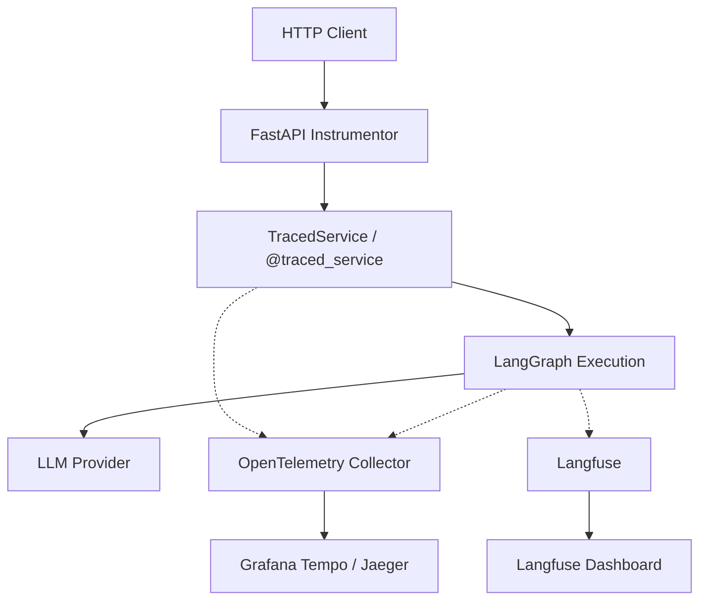

# Observability Module - 관찰성 및 모니터링 아키텍처

## 폴더 개요 (Directory Overview)

`observability/` 디렉토리는 Open LangGraph 플랫폼의 **실행 추적(Tracing), 모니터링(Monitoring) 및 관찰성(Observability)**을 담당합니다. 시스템 전반의 성능 병목 현상을 파악하고, 에이전트 실행의 투명성을 확보하기 위해 OpenTelemetry와 Langfuse를 통합하여 제공합니다.

이 모듈은 다음과 같은 핵심 가치를 제공합니다:
- **실시간 추적**: 모든 서비스 호출과 그래프 실행을 시각화
- **자동 계측 (Auto-Instrumentation)**: 코드 수정 없이 서비스 계층 전체를 자동으로 추적
- **유연한 통합**: OpenTelemetry(표준) 및 Langfuse(LLM 전용) 지원
- **제로 오버헤드**: 관찰성 기능이 비활성화되었을 때 시스템 부하 0% 보장

---

## 파일 목록 및 설명 (File List)

### 1. `auto_tracing.py` - 자동 서비스 트레이싱
**역할**: 서비스 클래스의 모든 메서드를 자동으로 추적하는 메커니즘 제공
- `TracedService`: 상속만으로 자동 추적이 활성화되는 베이스 클래스
- `@traced_service`: 클래스 데코레이터 방식의 자동 추적
- `TRACED_ATTRIBUTES`: 인자값에서 ID(assistant, thread, run 등)를 자동 추출하여 Span 속성으로 저장

### 2. `tracing.py` - 수동 트레이싱 데코레이터
**역할**: 특정 함수나 그래프 실행을 정밀하게 추적하기 위한 데코레이터 제공
- `@trace_function`: 일반 함수/메서드 추적
- `@trace_service_method`: 특정 서비스 메서드 추적 (수동 방식)
- `@trace_graph_execution`: LangGraph 실행 단계 추적 및 메타데이터 기록

### 3. `otel_integration.py` - OpenTelemetry 설정
**역할**: OpenTelemetry SDK 초기화 및 내보내기(Exporter) 설정
- `setup_opentelemetry()`: FastAPI 앱 및 HTTPX 클라이언트에 계측 적용
- OTLP Exporter 설정 (Collector 연결)
- BatchSpanProcessor를 통한 성능 최적화

### 4. `langfuse_integration.py` - Langfuse 통합
**역할**: LLM 전용 관찰성 도구인 Langfuse 연동
- `get_tracing_callbacks()`: LangGraph 실행 시 주입할 LangChain 호환 콜백 제공

---

## Auto-Tracing 상세 가이드

Auto-Tracing은 서비스 계층의 가시성을 극대화하기 위한 가장 권장되는 방법입니다.

### 1. TracedService 상속 방법
가장 간단한 사용법은 `TracedService`를 상속받는 것입니다.

```python
from src.agent_server.observability.auto_tracing import TracedService

class AssistantService(TracedService):
    async def create_assistant(self, assistant_id: str, graph_id: str):
        # 모든 공용 메서드가 자동으로 추적됩니다.
        # assistant_id와 graph_id는 자동으로 Span 속성에 기록됩니다.
        ...
```

### 2. @traced_service 데코레이터 사용법
기존 클래스 구조를 유지하면서 데코레이터만 추가할 수도 있습니다.

```python
from src.agent_server.observability.auto_tracing import traced_service

@traced_service
class ThreadService:
    async def get_thread(self, thread_id: str):
        ...
```

### 3. 자동 Span 속성 추출 (TRACED_ATTRIBUTES)
메서드 호출 시 다음과 같은 인자명이 감지되면 자동으로 Span 속성(`service.{name}`)으로 추출됩니다:
- `assistant_id`, `thread_id`, `run_id`, `graph_id`, `user_id`, `namespace`, `limit`, `offset`

추출된 값은 Grafana Tempo, Honeycomb, Jaeger 등에서 필터링 및 검색에 사용될 수 있습니다.

### 4. 메서드 제외 방법
- **언더스코어(`_`) 접두사**: `_private_method`와 같이 시작하는 메서드는 자동으로 추적에서 제외됩니다.
- **`__trace_exclude__` 속성**: 특정 공용 메서드를 제외하고 싶을 때 클래스에 리스트로 정의합니다.

```python
class MyService(TracedService):
    __trace_exclude__ = ["skip_this_method"]
    
    async def skip_this_method(self):
        # 추적되지 않음
        pass
```

### 5. 제로 오버헤드 (Zero Overhead)
`OTEL_ENABLED=false`일 경우, `__init_subclass__` 단계에서 래핑 로직이 아예 실행되지 않습니다. 런타임에 어떤 조건문 체크도 발생하지 않으므로 성능 저하가 전혀 없습니다.

---

## Manual Tracing 데코레이터

특정 지점을 더 상세히 기술하거나, 클래스 단위가 아닌 단일 함수를 추적할 때 사용합니다.

### trace_function
일반적인 로직 블록을 추적합니다.

```python
from src.agent_server.observability.tracing import trace_function

@trace_function(name="custom_logic", attributes={"category": "process"})
def process_data():
    ...
```

### trace_service_method
수동으로 서비스 이름을 지정하여 추적합니다 (Auto-tracing 사용 전 레거시 방식).

```python
class LegacyService:
    @trace_service_method(service_name="Legacy")
    async def do_work(self):
        ...
```

---

## 마이그레이션 가이드 (수동 → 자동)

기존의 개별 메서드 데코레이터를 제거하고 클래스 수준의 자동 추적을 도입하는 방법입니다.

**Before (수동):**
```python
class AssistantService:
    @trace_service_method("AssistantService")
    async def get_assistant(self, assistant_id: str): ...
    
    @trace_service_method("AssistantService")
    async def list_assistants(self): ...
```

**After (자동):**
```python
@traced_service
class AssistantService:
    async def get_assistant(self, assistant_id: str): ...
    async def list_assistants(self): ...
```

---

## 환경 변수 설정 (Environment Variables)

추적 기능을 활성화하려면 다음 환경 변수를 설정해야 합니다.

| 변수명 | 설명 | 기본값 |
|--------|------|--------|
| `OTEL_ENABLED` | OpenTelemetry 활성화 여부 | `false` |
| `OTEL_EXPORTER_OTLP_ENDPOINT` | OTLP 수집기 주소 (gRPC) | `http://localhost:4317` |
| `OTEL_SERVICE_NAME` | 서비스 이름 식별자 | `open-langgraph` |
| `LANGFUSE_LOGGING` | Langfuse 추적 활성화 여부 | `false` |
| `LANGFUSE_PUBLIC_KEY` | Langfuse 퍼블릭 키 | - |
| `LANGFUSE_SECRET_KEY` | Langfuse 시크릿 키 | - |
| `LANGFUSE_HOST` | Langfuse 호스트 주소 | `https://cloud.langfuse.com` |

---

## 관찰성 데이터 흐름 (Observability Data Flow)


